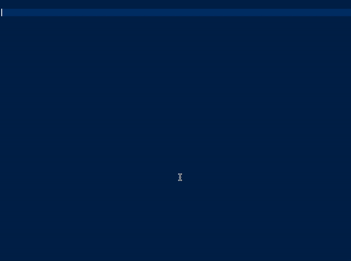
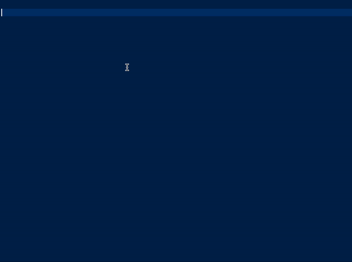

# Ex-Snippet

Sometimes Elixir modules such as `GenServer` and `GenStage` has a lot of boilerplates or configurations hence to save developer's time in copy pasting or memorizing these boilerplates, this snippet acts as a helper to generate code template for elixir modules such as `GenServer`, `GenStage`, `Supervisor`, and etc.

## Setup

To use this snippet in vscode, you will need to configure user snippet through the command pallete (MAC shortcut: `cmd + shift + p`).

You could either create a global snippet or a snippet that just target elixir file extension (`elixir.json`).

The snippet definition can be found in `ex-snippet.json` file. Simply copy paste the json file to the snippet configuration that you create.

## List of Snippets

The snippets contain in this repo are as follow:

### `genserver`

### `genstage.producer`

### `genstage.consumer`

### `genstage.producerconsumer`

### `supervisor`

### `consumersupervisor`

